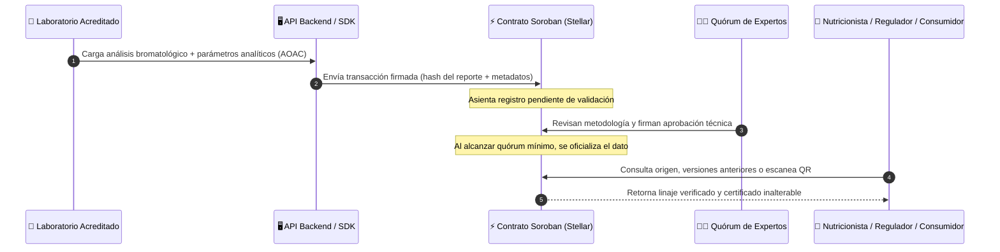

# 🥗 NutriTrust

### *Evidence-based nutrition. Immutable trust.*
### *Nutrición basada en evidencia. Confianza inmutable.*

**Infraestructura descentralizada para garantizar la trazabilidad, homologación y verificación de datos de composición de alimentos, construida sobre Stellar**
 
**Decentralized infrastructure to guarantee traceability, harmonization, and verifiability of food composition data, built on Stellar**

---

### 🇨🇴 [Español](#-español) • 🇺🇸 [English](#-english) • 📚 [Entregables](#-entregables--deliverables) • 📋 [Backlog Kanban](#-tablero-kanban--project-board) • 👥 [Equipo](#-equipo--team)

---

## 🇨🇴 Español

### 🎯 ¿Qué es NutriTrust?

La información sobre la composición nutricional de los alimentos hoy en día carece de una estructura unificada, vive en documentos estáticos o PDFs aislados y resulta sumamente difícil rastrear su procedencia metodológica. Al actualizarse tablas nacionales oficiales (como la TCAC en Colombia), cientos de alimentos locales quedan excluidos sin un repositorio histórico auditable. Además, ante discrepancias entre laboratorios o cambios de formulación, los profesionales de la salud deben asumir valores teóricos con altos riesgos clínicos y financieros.

**NutriTrust** propone un ecosistema descentralizado sobre **Stellar (Soroban)** donde cada análisis bromatológico queda registrado con la firma digital del laboratorio emisor, validado por un quórum multipartito de expertos independientes, y accesible en segundos para nutricionistas, investigadores clínicos, entidades regulatorias y consumidores.

> 🧪 **Estado:** Semana 2 del programa *Blockchain Builders 101* (BAF, Ruta N Medellín y Stellar). Product Blueprint, historias de usuario priorizadas, Lean Canvas y Backlog Kanban completados.

---

### 😩 El problema hoy vs. Solución NutriTrust

| Problema actual | Solución con NutriTrust |
|---|---|
| 📄 **Datos en PDFs estáticos** y tablas oficiales desactualizadas | Registro digital estructurado con hashes criptográficos en Stellar |
| 🗑️ **Pérdida de alimentos históricos** al actualizar tablas oficiales | Historial versionado e inmutable: ninguna actualización borra el pasado |
| 🏛️ **Monopolio institucional** en la publicación de datos | Consenso científico neutral gobernado por un quórum de validadores |
| ⏳ **Auditorías lentas** que toman días o semanas de cotejo | Verificación instantánea del linaje y método analítico (ej. AOAC) |
| 🏷️ **Etiquetas comerciales no verificables** | Vinculación criptográfica entre lote comercial y análisis de laboratorio |
| ⚠️ **Riesgo clínico y legal** por datos obsoletos | Certeza técnica inmediata para dietas terapéuticas y compras públicas |

---

### ⚙️ Cómo funciona el flujo de valor

---

### 🔗 ¿Por qué blockchain y no una base de datos tradicional?

- **Múltiples actores que no confían entre sí:** Laboratorios privados, fabricantes, ministerios e investigadores tienen intereses contrapuestos. Una base de datos centralizada obliga a depender de un único custodio arbitrario.
- **Histórico inalterable:** En investigación clínica y salud pública, el linaje metodológico debe preservarse permanentemente. Si un dato cambia o se corrige, la versión previa no debe desaparecer.
- **Eliminación del custodio unilateral:** El contrato inteligente garantiza que la validez del dato dependa de reglas matemáticas y firmas del quórum colegiado, no de la discrecionalidad política o comercial.

---

### 🛠️ Stack tecnológico previsto

- **Red:** Stellar Testnet (transacciones rápidas y costos de fracción de centavo)
- **Smart Contracts:** Soroban (Rust)
- **Backend:** Node.js + TypeScript con `@stellar/stellar-sdk`
- **Frontend:** React / Next.js
- **Almacenamiento:** Híbrido (Metadatos y hashes en Stellar; archivos bromatológicos y taxonomía detallada en IPFS / Base de datos relacional)

---

## 🇺🇸 English

### 🎯 What is NutriTrust?

Food nutritional composition data currently lacks unified structure, trapped in static PDFs or isolated institutional reports with fragile provenance tracking. When national food composition tables are updated, hundreds of traditional foods are dropped without an auditable history. Clinical nutritionists, food service planners, and clinical researchers are forced to assume theoretical values, leading to significant clinical and financial risks.

**NutriTrust** creates a decentralized infrastructure on **Stellar (Soroban)** where every bromatological analysis is digitally signed by accredited laboratories, verified by a multi-stakeholder technical quorum of experts, and accessible in seconds for clinicians, regulators, food producers, and consumers.

> 🧪 **Status:** Week 2 of the *Blockchain Builders 101* program (BAF, Ruta N Medellín & Stellar). Product Blueprint, prioritized user stories, Lean Canvas, and public Kanban backlog ready.

---

### 😩 The problem today vs. NutriTrust solution

| Current Problem | NutriTrust Solution |
|---|---|
| 📄 **Static PDFs** and outdated official tables | Structured digital records with cryptographic hashes on Stellar |
| 🗑️ **Loss of historical foods** across table updates | Versioned, immutable history: updates never erase the past |
| 🏛️ **Institutional bottleneck** in publishing reference data | Neutral scientific consensus governed by a validator quorum |
| ⏳ **Slow audits** taking days or weeks of manual reconciliation | Instant verification of analytical lineage and method (e.g., AOAC) |
| 🏷️ **Unverifiable food labels** | Cryptographic binding between commercial batches and lab tests |
| ⚠️ **Clinical and financial risk** from assumed numbers | Immediate certainty for clinical prescription and public food programs |

---

### 🔗 Why blockchain instead of a central database?

- **Untrusted independent parties:** Private labs, manufacturers, regulators, and universities have conflicting incentives. A standard database centralizes total control in a single authority.
- **Immutable scientific lineage:** In clinical trials and dietetics, evidence cannot be overwritten. Coexisting analyses and updates must remain auditable forever.
- **Removal of unilateral trust:** Smart contracts enforce quorum rules and signatures algorithmically without single-party gatekeeping.

---

## 📚 Entregables / Deliverables

| Semana / Week | Entregable / Deliverable | Descripción / Description | Enlace / Link |
|:---:|---|---|:---:|
| **Semana 1** | Propuestas individuales | Aportes individuales de ideación del equipo | [`docs/semana1/`](docs/semana1/) |
| **Semana 1** | Problem Brief | Documento grupal de definición del problema | [`docs/semana1/ProblemBrief.md`](docs/semana1/ProblemBrief.md) |
| **Semana 2** | Historias de usuario individuales | Historias de usuario por rol y priorización individual | [`docs/semana2/`](docs/semana2/) |
| **Semana 2** | Product Blueprint | Blueprint completo (propuesta de valor, alcance MVP, arquitectura, Stellar) | [`docs/semana2/ProductBlueprint.md`](docs/semana2/ProductBlueprint.md) |
| **Semana 2** | Lean Canvas | Lienzo de 9 bloques y diagrama vectorial | [`docs/semana2/LeanCanvas.md`](docs/semana2/LeanCanvas.md) • [SVG](docs/semana2/img/LeanCanvas.svg) |
| **Semana 2** | Tablero Kanban Oficial | Backlog priorizado público con 16 tarjetas y criterios BDD | [Tablero en GitHub Projects](https://github.com/users/Julilugo09/projects/1) |
| **Semana 3–5** | *En construcción* | Próximas entregas del programa | [`docs/`](docs/) |

---

## 📋 Tablero Kanban / Project Board

El backlog priorizado del equipo se gestiona activamente en **GitHub Projects** y se encuentra disponible públicamente para evaluación:

👉 **[Acceder al Tablero Kanban de NutriTrust](https://github.com/users/Julilugo09/projects/1)**

- **Columnas:** Backlog, Ready, In Progress, In review, Done.
- **Etiquetas de Priorización:** 🔴 Imprescindible (Must Have), 🟡 Debería (Should Have), 🟢 Podría (Could Have).
- **Criterios de Aceptación:** Cada tarjeta contiene criterios en formato *Dado / Cuando / Entonces*.

---

## 👥 Equipo / Team

| Santiago Mesa | Juliana Lugo | Yuen Fey Alvarez Porras | Nicolas Alvarino Laguna | Carlos Arturo Bermúdez |
|:---:|:---:|:---:|:---:|:---:|
|  |  |  |  |  |
| **Smart Contract Dev** | **Full Stack Developer** | **Investigación & Validación** | **QA & Documentación** | **Ingeniero** |
|   |   |   |   |  |

---

### 💜 Hecho con ❤️ sobre Stellar · Made with ❤️ on Stellar

**Blockchain Acceleration Foundation — Blockchain Builders 101 · Ruta N Medellín**

