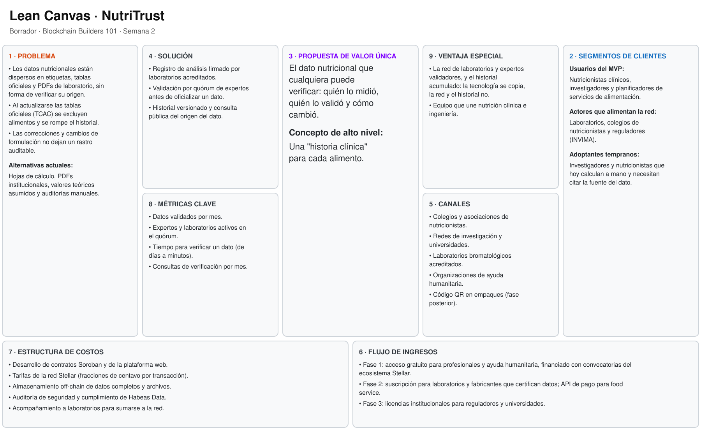
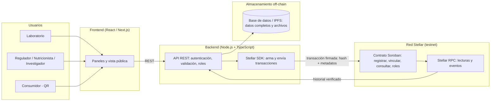

# Product Blueprint – NutriTrust

**Equipo:** Nicolás Alvarino Laguna, Yuen Fey Alvarez Porras, Santiago Mesa, Juliana Lugo, Carlos Bermudez Rios
**Programa:** Blockchain Builders 101 – BAF, Ruta N Medellín y Stellar
**Entrega:** Semana 2 – Domingo 4 de octubre
**Repositorio:** [NutriTrust](https://github.com/Yuenfey/NutriTrust)
**Tablero Kanban:** [Backlog Kanban NutriTrust](https://github.com/users/nicolasalvarino-l/projects/3)

---

## 1. Priorización de historias

Revisamos entre todos las historias que cada uno escribió y nos dimos cuenta de que había varias que se repetían o que se solapaban entre roles. Después de agruparlas y quitar duplicados, nos quedamos con un conjunto que representa el flujo completo del producto: desde el laboratorio que registra el dato hasta el consumidor que lo verifica.

Para priorizar usamos dos cosas al mismo tiempo: una matriz sencilla de valor contra complejidad, y el marco MoSCoW que vimos en clase. La pregunta que nos hacíamos con cada historia era si sin esa funcionalidad el producto todavía resolvía el problema. Las que no pasaban ese filtro las dejamos clasificadas como deseables o fuera del MVP.

Las historias que quedaron en el backlog son estas:

1. Registrar los resultados del análisis nutricional con fecha y responsable (laboratorio) — Imprescindible
2. Vincular la etiqueta del producto con el análisis certificado (productor) — Imprescindible
3. Consultar el historial completo de análisis y modificaciones de un producto (regulador) — Imprescindible
4. Asignar roles y permisos diferenciados por tipo de actor (administrador) — Imprescindible
5. Confirmar qué laboratorio certificó un dato y en qué fecha (nutricionista) — Debería
6. Acceder a la procedencia exacta y versiones anteriores de un dato (investigador) — Debería
7. Verificar el origen y validez del dato antes de comprar (consumidor) — Podría
8. Recibir notificación cuando un dato nutricional es actualizado (regulador) — Podría

Todo esto vive en el tablero de GitHub Projects del equipo, con cada historia como una tarjeta con sus criterios de aceptación.

---

## 2. Propuesta de valor

La información nutricional de un alimento hoy está regada por todas partes. La etiqueta dice una cosa, la base de datos pública dice otra, el laboratorio guarda un PDF en su correo, y el fabricante tiene su propio archivo interno. Cuando alguien detecta una diferencia, verificarla toma días de llamadas y correos. Un nutricionista no puede confirmar quién certificó el dato que está usando para armar una dieta. Un regulador no puede rastrear cómo cambió la formulación de un producto en el tiempo. Y un consumidor con una alergia o una condición metabólica decide sin poder confirmar si lo que lee es real.

NutriTrust cambia esa situación. Ofrecemos un registro compartido y verificable donde cada análisis nutricional queda grabado con evidencia de quién lo hizo, cuándo y con qué resultado. Lo que el usuario gana es tiempo y certeza: lo que antes tomaba días confirmar, ahora se resuelve en segundos.

Un nutricionista puede ver en un clic qué laboratorio certificó el dato que va a usar. Un regulador audita el historial completo de un producto sin pedirle reportes a la empresa. Un consumidor escanea el código del empaque y ve el recorrido completo del dato desde el análisis inicial.

Lo que nos diferencia de lo que existe hoy es que no dependemos de una entidad central que concentre la confianza. Cada actor mantiene su autonomía, pero todos comparten el mismo registro. Eso reduce los costos de auditoría, elimina verificaciones repetidas y devuelve la confianza al dato. El usuario elige NutriTrust porque es la única forma de que la trazabilidad nutricional deje de ser una promesa del fabricante y se convierta en algo que cualquiera puede comprobar.

---

## 3. Flujo de usuario

El recorrido de la persona dentro de NutriTrust tiene tres momentos claros.

**Entrada – el laboratorio registra el análisis.** Un técnico de laboratorio entra a la plataforma con su cuenta institucional. Carga los datos: identificador del producto, lote, método usado, resultados numéricos y el archivo de respaldo. El sistema genera un identificador único y graba el registro con la fecha y el nombre del responsable. *(Verbo: registrar. Rol: laboratorio).*

**Pasos intermedios – la cadena se construye.** Primero, el productor recibe la confirmación del análisis y vincula su etiqueta al certificado del laboratorio. *(Verbo: vincular. Rol: productor).* Después, el administrador asigna roles y permisos a los actores nuevos que se van sumando a la red. *(Verbo: asignar. Rol: administrador).* Más adelante, el regulador consulta el historial completo del producto y verifica que cumpla con la normativa alimentaria; si detecta cambios, revisa la versión anterior y la actual. *(Verbo: auditar. Rol: regulador).* También el nutricionista entra a confirmar qué laboratorio certificó el dato que piensa usar en una dieta especializada. *(Verbo: verificar. Rol: nutricionista).* Y el investigador descarga el historial verificado para usarlo como fuente en un estudio. *(Verbo: consultar. Rol: investigador).*

**Salida – el consumidor verifica.** El consumidor escanea el código del empaque con el celular. Se abre una vista pública que muestra el origen del producto, el laboratorio que certificó el dato, la fecha del último análisis y un sello de verificación. Si el dato tuvo modificaciones, ve la versión anterior y la actual. Termina su recorrido sabiendo que la información que está leyendo no fue alterada después de su registro. *(Verbo: verificar. Rol: consumidor).*

---

## 4. Alcance del MVP

El MVP de NutriTrust gira alrededor de una sola promesa: registrar un análisis nutricional y poder verificarlo después. Todo lo que no aporte directo a esa promesa se deja para más adelante.

**Lo que sí entra (Imprescindible):**
Registro de análisis por parte de un laboratorio autenticado, con fecha, responsable y archivo de respaldo. Vinculación entre el análisis certificado y la etiqueta del producto. Consulta del historial completo de un producto, incluyendo versiones anteriores y responsables de cada cambio. Roles y permisos diferenciados por tipo de actor.

**Lo que quisiéramos pero no entra en el MVP (Debería y Podría):**
Notificaciones automáticas cuando un dato se actualiza, historial agregado por finca o fabricante, perfil público del productor o laboratorio, chat entre actores, calificación de productos, pago automático por certificación e integración con los sistemas internos de los fabricantes.

**Lo que queda fuera por completo:** catálogo público de productos con búsqueda avanzada, panel de analítica para fabricantes y exportación masiva de reportes.

El recorte lo hicimos pensando en que el núcleo del problema es la falta de un registro verificable y compartido, no la falta de funciones adicionales. Con registrar, vincular, consultar y controlar permisos ya se ataca la fricción principal: la imposibilidad de rastrear el origen y los cambios de un dato. Las funciones que sacamos mejoran la experiencia, pero el producto resuelve el problema sin ellas. Además, el alcance reducido nos permite llegar a un MVP funcional en la testnet de Stellar dentro del tiempo del programa, y esas funciones se pueden sumar después sin rediseñar la arquitectura.

---

## 5. Lean Canvas

**Enlace al Lean Canvas:** [Lean Canvas de NutriTrust](LeanCanvas.md)

El lienzo cubre problema, segmento de usuarios, propuesta de valor única, solución, canales, métricas clave, ventaja diferencial y estructura de costos e ingresos. En el enlace está también la versión en texto.

---

## 6. Backlog priorizado (Kanban)

El backlog vive como tablero Kanban en GitHub Projects. Usamos cinco columnas: Backlog, Ready, In Progress, In review y Done. Cada tarjeta tiene su historia de usuario, criterios de aceptación en formato Dado / Cuando / Entonces, la etiqueta MoSCoW correspondiente y el responsable asignado.

**Enlace al tablero:** https://github.com/users/nicolasalvarino-l/projects/3

**Ejemplo de criterios de aceptación por tarjeta:**

**Registrar análisis nutricional (Imprescindible)**
- Dado que soy un laboratorio autenticado, cuando ingreso los datos del análisis y confirmo el registro, entonces el sistema crea un registro único con identificador, fecha y responsable.
- Dado que el registro fue creado, cuando consulto su identificador, entonces veo los datos completos y el sello de verificación.
- Dado que intento registrar sin autenticarme, cuando envío el formulario, entonces el sistema bloquea la acción.

**Consultar historial de un producto (Imprescindible)**
- Dado que tengo el identificador de un producto, cuando ingreso a la vista de consulta, entonces veo el historial completo con fechas, responsables y resultados.
- Dado que un dato fue modificado, cuando consulto el historial, entonces veo la versión anterior y la actual con sus marcas de tiempo.

Las demás tarjetas siguen el mismo formato y están disponibles en el tablero.

---

## 7. Arquitectura inicial

La arquitectura de NutriTrust está organizada en cuatro capas que conectan la interfaz del usuario con la red Stellar.

*Stellar entra en la flecha "transacción firmada".*

**Frontend:** una aplicación web en React/Next.js. Tiene tres vistas principales: el panel del laboratorio para registrar análisis, el panel de consulta para reguladores, nutricionistas e investigadores, y la vista pública que se abre al escanear el código QR de un producto. La interfaz se comunica con el backend mediante una API REST.

**Backend:** un servicio en Node.js con TypeScript. Se encarga de la autenticación, la validación de datos, el control de roles y permisos, y de armar las transacciones que van a Stellar. Es la capa que media entre el usuario y la red.

**Contrato inteligente en Soroban:** un contrato en Rust desplegado en la testnet de Stellar con cuatro funciones principales: registrar un análisis, vincular una etiqueta, consultar el historial y asignar roles. Guarda hashes y metadatos, no los datos completos, para reducir costos y proteger la privacidad.

**Red Stellar:** cada actor tiene su cuenta con su par de claves. Las transacciones se firman con la clave del laboratorio o del productor. Los datos completos (resultados numéricos, archivos) se guardan fuera de la cadena, en IPFS o en una base de datos, y solo el hash va a la red.

**El punto exacto donde entra Stellar:** cuando el backend envía la transacción firmada al contrato Soroban. El contrato valida la firma, verifica los permisos según el rol del actor y graba el registro. Cualquier actor autorizado puede consultar el historial llamando a las funciones de lectura del contrato a través de Stellar RPC. La interfaz nunca habla directamente con la red; siempre pasa por el backend, que actúa como capa de seguridad y abstracción.

---

## 8. Uso de Stellar y justificación

Cada componente de Stellar cumple un papel concreto en NutriTrust:

- **Cuentas Stellar:** son la identidad de cada actor. Laboratorios, productores y reguladores firman con su propia clave, así que nadie puede hacerse pasar por otro.
- **Soroban:** aloja la lógica del negocio (registro de análisis, vinculación de etiquetas, historial y control de acceso) como reglas verificables que no dependen de un intermediario.
- **Transacciones:** cada registro o modificación genera una transacción firmada con sello de tiempo en el ledger. Esa es la base de la trazabilidad.
- **Stellar SDK (JavaScript/TypeScript) y Stellar RPC:** el SDK construye y envía las transacciones desde el backend; el RPC permite consultar el estado del contrato y sus eventos.
- **Testnet:** permite construir y validar el MVP sin costo y deja evidencia verificable en la red.

**Por qué Stellar.** El Problem Brief concluyó que el caso necesita un registro distribuido porque laboratorios, fabricantes y reguladores no confían plenamente entre sí y deben compartir un mismo registro. Además, el histórico no puede alterarse: cada análisis y cada corrección debe dejar evidencia permanente. Y se elimina el intermediario que hoy concentra la confianza, ya que ningún laboratorio ni plataforma central controla el dato.

Stellar encaja con esas necesidades por sus costos de transacción muy bajos, clave para registrar miles de análisis; por sus SDKs en JavaScript y TypeScript, que se ajustan al stack del equipo; y porque Soroban ofrece los contratos que necesitamos sin la complejidad ni los costos de otras redes. Así, la información nutricional verificable puede llegar a cualquier persona.

---