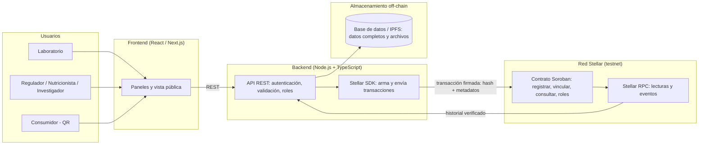

# Product Blueprint – NutriTrust

**Equipo:** Nicolás Alvarino Laguna, Yuen Fey Alvarez Porras, Santiago Mesa, Juliana Lugo, Carlos Bermudez Rios
**Programa:** Blockchain Builders 101 – BAF, Ruta N Medellín y Stellar
**Entrega:** Semana 2 – Domingo 4 de octubre
**Repositorio:** [NutriTrust](https://github.com/Yuenfey/NutriTrust)
**Tablero Kanban:** [Backlog Kanban NutriTrust](https://github.com/users/nicolasalvarino-l/projects/3)

---

## 1. Priorización de historias

Revisamos entre todos las historias propuestas por cada integrante del equipo y consolidamos aquellas que cubren el ciclo de vida del dato bromatológico: desde su emisión y validación científica, hasta su auditoría y consumo final.

**Criterio de priorización:** Marco MoSCoW (Imprescindible, Debería, Podría) ponderado con una matriz de valor clínico/regulatorio versus complejidad técnica. Evaluamos si el producto resuelve el dolor central de procedencia y trazabilidad sin cada función.

| Prioridad | Historia | Propuesta por | Por qué entra al backlog |
| :---: | --- | :---: | --- |
| 1 (Imprescindible) | Registrar los resultados del análisis nutricional con fecha, responsable y método analítico. | Nicolás Alvarino / Juliana Lugo | Es la condición habilitante del sistema para registrar el dato original con evidencia técnica. |
| 2 (Imprescindible) | Aprobar o rechazar colegiadamente un análisis propuesto mediante quórum técnico. | Santiago Mesa / Yuen Alvarez | Materializa el consenso científico neutral, sustituyendo la dependencia en un custodio único. |
| 3 (Imprescindible) | Vincular la etiqueta comercial del producto con el análisis certificado en laboratorio. | Nicolás Alvarino | Permite certificar la veracidad de la información declarada ante clientes y reguladores. |
| 4 (Imprescindible) | Asignar y revocar roles y permisos diferenciados según acreditación institucional. | Santiago Mesa | Asegura la confiabilidad de la red garantizando que solo actores autorizados firmen registros. |
| 5 (Imprescindible) | Consultar el historial completo y procedencia de modificaciones de un alimento. | Nicolás Alvarino / Yuen Alvarez | Resuelve la auditoría de linaje e impide que actualizaciones borren registros históricos. |
| 6 (Debería) | Acceder a datos bromatológicos estandarizados mediante un canal unificado de consulta. | Juliana Lugo | Permite a sistemas clínicos e investigadores interoperar directamente con evidencia verificada. |
| 7 (Debería) | Confirmar laboratorio certificador, fecha y parámetros de ensayo de un dato. | Yuen Alvarez / Juliana Lugo | Brinda certeza técnica inmediata para cálculos nutricionales y prescripciones terapéuticas. |
| 8 (Podría) | Verificar el origen y validez del dato escaneando el empaque del producto. | Nicolás Alvarino / Santiago Mesa | Aporta transparencia directa al consumidor final, condicionada a la vinculación de etiquetas. |

Todo esto vive en el tablero de GitHub Projects del equipo, con cada historia como una tarjeta con sus criterios de aceptación.

---

## 2. Propuesta de valor

La información nutricional de un alimento hoy está regada por todas partes. La etiqueta dice una cosa, la base de datos pública dice otra, el laboratorio guarda un PDF en su correo, y el fabricante tiene su propio archivo interno. Cuando alguien detecta una diferencia, verificarla toma días de llamadas y correos. Un nutricionista no puede confirmar quién certificó el dato que está usando para armar una dieta. Un regulador no puede rastrear cómo cambió la formulación de un producto en el tiempo. Y un consumidor con una alergia o una condición metabólica decide sin poder confirmar si lo que lee es real.

NutriTrust cambia esa situación. Ofrecemos un registro compartido y verificable donde cada análisis nutricional queda grabado con evidencia de quién lo hizo, cuándo y con qué resultado. Lo que el usuario gana es tiempo y certeza: lo que antes tomaba días confirmar, ahora se resuelve en segundos.

Un nutricionista puede ver en un clic qué laboratorio certificó el dato que va a usar. Un regulador audita el historial completo de un producto sin pedirle reportes a la empresa. Un consumidor escanea el código del empaque y ve el recorrido completo del dato desde el análisis inicial.

Lo que nos diferencia de lo que existe hoy es que no dependemos de una entidad central que concentre la confianza. Cada actor mantiene su autonomía, pero todos comparten el mismo registro. Eso reduce los costos de auditoría, elimina verificaciones repetidas y devuelve la confianza al dato. El usuario elige NutriTrust porque es la única forma de que la trazabilidad nutricional deje de ser una promesa del fabricante y se convierta en algo que cualquiera puede comprobar.

---

## 3. Flujo de usuario

El recorrido de la persona dentro de NutriTrust tiene tres momentos claros.

**Entrada – el laboratorio registra el análisis.** Un técnico de laboratorio entra a la plataforma con su cuenta institucional. Carga los datos: identificador del producto, lote, método usado, resultados numéricos y el archivo de respaldo. El sistema genera un identificador único y graba el registro con la fecha y el nombre del responsable. *(Verbo: registrar. Rol: laboratorio).*

**Pasos intermedios – la cadena se construye.** Primero, el productor recibe la confirmación del análisis y vincula su etiqueta al certificado del laboratorio. *(Verbo: vincular. Rol: productor).* Después, el administrador asigna roles y permisos a los actores nuevos que se van sumando a la red. *(Verbo: asignar. Rol: administrador).* Más adelante, el regulador consulta el historial completo del producto y verifica que cumpla con la normativa alimentaria; si detecta cambios, revisa la versión anterior y la actual. *(Verbo: auditar. Rol: regulador).* También el nutricionista entra a confirmar qué laboratorio certificó el dato que piensa usar en una dieta especializada. *(Verbo: verificar. Rol: nutricionista).* Y el investigador descarga el historial verificado para usarlo como fuente en un estudio. *(Verbo: consultar. Rol: investigador).*

**Salida – el consumidor verifica.** El consumidor escanea el código del empaque con el celular. Se abre una vista pública que muestra el origen del producto, el laboratorio que certificó el dato, la fecha del último análisis y un sello de verificación. Si el dato tuvo modificaciones, ve la versión anterior y la actual. Termina su recorrido sabiendo que la información que está leyendo no fue alterada después de su registro. *(Verbo: verificar. Rol: consumidor).*

---

## 4. Alcance del MVP

El MVP de NutriTrust gira alrededor de una sola promesa: registrar un análisis nutricional y poder verificarlo después. Todo lo que no aporte directo a esa promesa se deja para más adelante.

**Lo que sí entra (Imprescindible):**
Registro de análisis por parte de un laboratorio autenticado, con fecha, responsable y archivo de respaldo. Vinculación entre el análisis certificado y la etiqueta del producto. Consulta del historial completo de un producto, incluyendo versiones anteriores y responsables de cada cambio. Roles y permisos diferenciados por tipo de actor.

**Lo que quisiéramos pero no entra en el MVP (Debería y Podría):**
Notificaciones automáticas cuando un dato se actualiza, historial agregado por finca o fabricante, perfil público del productor o laboratorio, chat entre actores, calificación de productos, pago automático por certificación e integración con los sistemas internos de los fabricantes.

**Lo que queda fuera por completo:** catálogo público de productos con búsqueda avanzada, panel de analítica para fabricantes y exportación masiva de reportes.

El recorte lo hicimos pensando en que el núcleo del problema es la falta de un registro verificable y compartido, no la falta de funciones adicionales. Con registrar, vincular, consultar y controlar permisos ya se ataca la fricción principal: la imposibilidad de rastrear el origen y los cambios de un dato. Las funciones que sacamos mejoran la experiencia, pero el producto resuelve el problema sin ellas. Además, el alcance reducido nos permite llegar a un MVP funcional en la testnet de Stellar dentro del tiempo del programa, y esas funciones se pueden sumar después sin rediseñar la arquitectura.

---

## 5. Lean Canvas

| Bloque | Contenido |
|---|---|
| **Problema** | Datos nutricionales fragmentados, no verificables y difíciles de auditar. Cada actor guarda sus registros por separado. Auditorías lentas y costosas. |
| **Segmento de clientes** | Laboratorios de análisis, fabricantes de alimentos, organismos reguladores como el INVIMA, nutricionistas, investigadores y consumidores con restricciones alimentarias. |
| **Propuesta de valor única** | Trazabilidad verificable de la información nutricional, accesible a todos los actores sin depender de una entidad central. |
| **Solución** | Plataforma sobre Stellar que registra cada análisis en un historial compartido e inalterable, con roles diferenciados y consulta pública. |
| **Canales** | Integración por API con laboratorios, portal web para reguladores, panel de consulta para nutricionistas e investigadores, código QR en empaques para consumidores. |
| **Métricas clave** | Análisis registrados por mes, tiempo promedio de auditoría (que esperamos bajar de días a minutos), actores activos por rol, porcentaje de productos con trazabilidad completa, verificaciones mensuales. |
| **Ventaja diferencial** | El historial inalterable más la red de actores que se va construyendo. La tecnología se puede copiar, la red de laboratorios, reguladores y fabricantes conectados no. |
| **Estructura de costos** | Desarrollo y mantenimiento de la plataforma, infraestructura de nodos Stellar, soporte técnico, cumplimiento regulatorio y difusión B2B. |
| **Flujo de ingresos** | Suscripción mensual para laboratorios y fabricantes, licencia anual para organismos reguladores, API premium para integraciones y certificaciones verificables con sello NutriTrust. |

---

## 6. Backlog priorizado (Kanban)

El backlog vive como tablero Kanban en GitHub Projects. Usamos cinco columnas: Backlog, Ready, In Progress, In review y Done. Cada tarjeta tiene su historia de usuario, criterios de aceptación en formato Dado / Cuando / Entonces, la etiqueta MoSCoW correspondiente y el responsable asignado.

**Enlace al tablero:** https://github.com/users/nicolasalvarino-l/projects/3

**Ejemplo de criterios de aceptación por tarjeta:**

**Registrar análisis nutricional (Imprescindible)**
- Dado que soy un laboratorio autenticado, cuando ingreso los datos del análisis y confirmo el registro, entonces el sistema crea un registro único con identificador, fecha y responsable.
- Dado que el registro fue creado, cuando consulto su identificador, entonces veo los datos completos y el sello de verificación.
- Dado que intento registrar sin autenticarme, cuando envío el formulario, entonces el sistema bloquea la acción.

**Consultar historial de un producto (Imprescindible)**
- Dado que tengo el identificador de un producto, cuando ingreso a la vista de consulta, entonces veo el historial completo con fechas, responsables y resultados.
- Dado que un dato fue modificado, cuando consulto el historial, entonces veo la versión anterior y la actual con sus marcas de tiempo.

Las demás tarjetas siguen el mismo formato y están disponibles en el tablero.

---

## 7. Arquitectura inicial

La arquitectura de NutriTrust se organiza en cuatro capas que articulan la interfaz con la red Stellar:

| Capa | Componente | Qué hace |
| :---: | --- | --- |
| **Interfaz** | React / Next.js | Paneles de laboratorio, vista de auditoría para profesionales y consulta pública vía código QR. |
| **Lógica** | Node.js + TypeScript | Autenticación, control de roles, persistencia off-chain y construcción de transacciones con Stellar SDK. |
| **Almacenamiento** | Base de datos / IPFS | Almacena reportes completos y archivos bromatológicos para optimizar costos de red. |
| **Stellar** | Soroban (Rust) en Testnet | Contrato inteligente que valida firmas, graba hashes inmutables y ejecuta el consenso técnico. |

**En qué punto entra la red:**
Stellar entra en acción cuando el backend envía la transacción firmada (hash criptográfico del análisis y metadatos) al contrato Soroban. El contrato valida la firma del actor acreditado, aplica las reglas de acceso y graba el registro inmutable en el ledger. Luego, cualquier usuario o entidad audita el historial consultando el contrato mediante Stellar RPC. La interfaz nunca interactúa directamente con la red sin pasar por el backend.

---

## 8. Uso de Stellar y justificación

Cada componente de Stellar cumple un papel concreto en NutriTrust:

- **Cuentas Stellar:** son la identidad de cada actor. Laboratorios, productores y reguladores firman con su propia clave, así que nadie puede hacerse pasar por otro.
- **Soroban:** aloja la lógica del negocio (registro de análisis, vinculación de etiquetas, historial y control de acceso) como reglas verificables que no dependen de un intermediario.
- **Transacciones:** cada registro o modificación genera una transacción firmada con sello de tiempo en el ledger. Esa es la base de la trazabilidad.
- **Stellar SDK (JavaScript/TypeScript) y Stellar RPC:** el SDK construye y envía las transacciones desde el backend; el RPC permite consultar el estado del contrato y sus eventos.
- **Testnet:** permite construir y validar el MVP sin costo y deja evidencia verificable en la red.

**Por qué Stellar.** El Problem Brief concluyó que el caso necesita un registro distribuido porque laboratorios, fabricantes y reguladores no confían plenamente entre sí y deben compartir un mismo registro. Además, el histórico no puede alterarse: cada análisis y cada corrección debe dejar evidencia permanente. Y se elimina el intermediario que hoy concentra la confianza, ya que ningún laboratorio ni plataforma central controla el dato.

Stellar encaja con esas necesidades por sus costos de transacción muy bajos, clave para registrar miles de análisis; por sus SDKs en JavaScript y TypeScript, que se ajustan al stack del equipo; y porque Soroban ofrece los contratos que necesitamos sin la complejidad ni los costos de otras redes. Así, la información nutricional verificable puede llegar a cualquier persona.

---